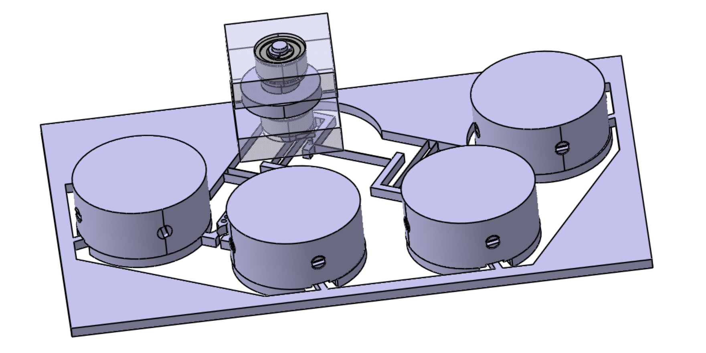
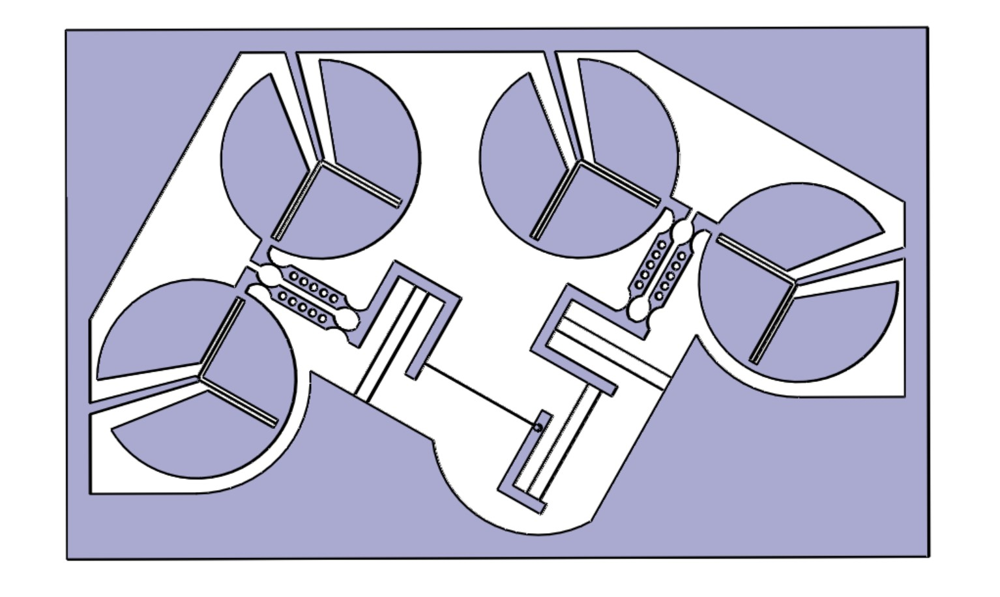

# Balanced-IsoSpring
Balanced IsoSpring is a 2 DOF balanced oscillator implemented with flexure mechanisms. This project is dedicated to improve the actual mechanical watches with a new technology. We realized this work in Simon Henein's class.

  
  &nbsp; &nbsp; &nbsp;
  

## Project
From the [brief of the project](projectbrief.pdf) we first designed 4 mechanisms ideas as [boards](boards). Which contains the ideal guiding with a Grübler analysis and its flexure mechanisms implementation. The 5th board is an overview with pros and cons of the ideas, showing why we selected the final mechanism.  
Nb: We actually chose another final solution, different from the one presented in the 5th board ; as our teacher suggested.

The final project is presented in its integrality in the file [Balanced-IsoSpring](Balanced-IsoSpring.pdf). We used CATIA to draw the technical schemes, based on the 3D design of the full mechanism we created in the software. The [full design file](IsoSpring-CATIA.stp) can be downloaded and extracted with CATIA V5 6R2018.

Many results presented in the project were calculated using Matlab. The different scripts can be found in the directory [matlab](matlab).  
- [KEQ](matlab/KEQ.m) computes the equivalent-spring constant of the oscillating mechanism.
- [Plot2D](matlab/Plot2D.m) and [Plot3D](matlab/Plot3D.m) plot the equivalent-spring constant considering the buckling depending on the position of the oscillation. This assumption makes the spring non-isotropic, which is discussed in the report. We can observe the variation of KEQ following one or two axis (2D or 3D plot), and the gradient feature which is not presented in the project but helped us to interpret the plots.
- [Fleche lame coin](matlab/fleche_lame_coin.m) computes and plots the maximum flexion curve of the massive wheels.
- [Projet tab](matlab/projet_tab.m) computes many variables depending on dimensional parameters and more.

## References
*Conception des guidages flexibles, Simon Henein* ([link](https://www.epflpress.org/product/666/9782889143368/conception-des-guidages-flexibles)): [extract](SimonHenein-extract.pdf)

## License
[MIT License](LICENSE)
